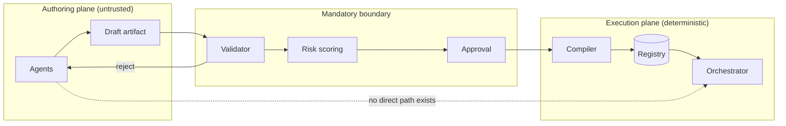

# ADR 0002: Workflow Execution Model

## Status

Proposed

## Date

2026-09-06

## Supersedes / Extends

Extends `ADR-0001-core-architecture.md`. Does not supersede it. The five layers defined in ADR-0001 remain authoritative; this ADR adds one layer and defines the execution semantics that layer owns.

## Related Documents

- `omniflow-architecture-and-vision.md` — the full architecture and vision this decision underpins
- `.github/copilot-instructions.md` — repository behavioural rules
- `docs/architecture.md`, `docs/modules.md`, `docs/data-flow.md`
- `docs/agent-workflow.md`, `docs/agent-safety.md`
- `docs/pentest-flow.md`, `docs/ci-cd.md`

---

## Context

The repository already defines a layered, zero-trust, agent-governed architecture (ADR-0001). What it does not define is **how an automated process is represented and executed** — the concrete model that lets a single system replace the heterogeneous automation estate of the company: cron jobs, PowerShell and Python scripts, low-code SaaS automations, CI pipelines used as schedulers, and manual runbooks.

Three forces drive this decision.

**1. Auditability.** The company cannot currently answer "what automated processes exist, what did they do last night, and who approved them?" Any execution model chosen must make that question answerable by construction, not by convention.

**2. Zero trust applied to AI.** The system is intended to be AI-driven. ADR-0001 mandates that all inputs are untrusted. AI output is an input. An execution model that lets a model's output reach production directly would violate the repository's foundational security posture, regardless of how well the model performs.

**3. Determinism under retry.** Automation that touches external systems will be retried — by operators, by schedulers, by network layers. An execution model without first-class idempotency semantics produces duplicate charges, duplicate messages and duplicate tickets. This is the most common and most expensive failure class in workflow systems, and it must be addressed in the model rather than in each workflow.

Additional constraints inherited from the repository:

- module boundaries must remain strict, with no cross-module state sharing,
- security must be embedded in every layer, not appended,
- CI/CD must remain deterministic and fail-fast,
- all architectural decisions must be documented and diagrammed,
- the multi-agent model must operate under the guardrails of `docs/agent-safety.md`.

---

## Decision

We adopt a **declarative workflow-artifact model with a deterministic execution engine and an AI authoring plane**.

The decision has six parts. All six are binding together; adopting a subset does not deliver the properties this ADR is intended to secure.

### D1. A workflow is a declarative artifact, not code

A workflow is expressed as a **manifest**: a schema-validated declarative document describing triggers, typed inputs, a directed acyclic graph of steps, guards, typed outputs and policy. There is no general-purpose programming construct in the manifest. Conditions use a small, sandboxed, deliberately **non-Turing-complete** expression language. Logic exceeding that expressiveness must move into a capability (D3), not into the manifest.

### D2. Manifest, plan and run are separate artifacts with separate lifecycles

| Artifact | Mutability |
|---|---|
| Manifest | Mutable while draft; immutable once published, versioned by semver |
| Execution plan | Always immutable, content-addressed by hash, produced by a pure compilation function |
| Run | Mutable state machine whose history is append-only |

Compilation is a pure function: the same manifest plus the same registry state produces a byte-identical plan. Every run records the plan hash it executed.

### D3. All external effects occur through versioned capabilities

A **capability** is the only path from the engine to any external system. It declares a typed input and output schema, an **effect class** (`pure`, `idempotent`, `effectful`), required scopes, an explicit egress allow-list, a cost model, enumerated failure modes, an optional compensation, and a data classification ceiling.

An `effectful` capability used without an idempotency key is a **compile-time error**, not a runtime warning.

Every adapter must honour a **dry-run flag** that suppresses external effects while exercising the full execution path. This is required from the first adapter, because it is what makes shadow-mode migration possible.

### D4. The AI authoring plane is structurally separated from the execution plane

Agents — Planner, Architecture, Analysis, Pentest, Documentation, Refactor — operate only in the Authoring and Insight planes. They produce **drafts and proposals**. No agent has a write path to the workflow registry, the scheduler, the orchestrator or any capability adapter.

Every agent output crosses the same validation, risk-scoring and approval boundary as any untrusted external input. AI-generated drafts sit, explicitly, on the untrusted side of the trust boundary.

Autonomy is a governed per-workflow, per-environment setting (T0 advisory, T1 assisted, T2 supervised, T3 bounded-autonomous). **T1 is the default.** T3 is constrained by a declared blast radius: reversible steps only, no `confidential` data, no `effectful` capability above a cost ceiling.

### D5. Determinism is enforced by the compiler, not requested of authors

- Steps may not read the clock. Time enters through `context.now`, fixed at run start and recorded on the run.
- Steps may not generate unseeded randomness. Random values derive from a seed recorded on the run.
- Fan-out (`map`, `parallel`) is bounded at compile time.
- Recursion depth of `subworkflow` steps is bounded at compile time.
- Cumulative capability scope is analysed across the whole plan, not per step, so privilege escalation through composition is detected before execution.

### D6. A new Orchestration layer is added to the ADR-0001 layer model

| Layer | Source | Owns |
|---|---|---|
| Core | ADR-0001 | Models, error taxonomy, validation and logging primitives |
| Modules | ADR-0001 | Isolated functional units |
| **Orchestration** | **This ADR** | Registry, compiler, trigger management, scheduling, orchestration, step runtime |
| Pipeline | ADR-0001 | CI/CD, deterministic builds, artifact promotion |
| Security | ADR-0001 | Validation, policy, secret brokering, pentest heuristics |
| Documentation | ADR-0001 | Architecture, ADRs, generated workflow documentation |

Dependency rules from ADR-0001 are extended:

- Orchestration depends on Modules, Core and Security.
- **Orchestration must not depend on Pipeline.** Triggering CI is done through a capability adapter like any other external system.
- The Orchestrator holds no external network access, by structural constraint, because it holds the most authority in the system.

---

## Rationale

| Decision | Why |
|---|---|
| D1 — declarative artifact | A data structure can be diffed, reviewed, statically analysed, schema-validated and safely generated by a model. Arbitrary code can be none of those things cheaply. This single choice is what makes both auditability and safe AI authoring achievable. |
| D2 — three artifacts | Separating the human-readable manifest from the fully resolved plan makes "why did that specific run behave that way?" answerable by hash, and makes compilation semantics regression-testable. |
| D3 — capability boundary | Confining all external effects to one contract means absorbing a new class of workflow requires an adapter, not an engine change. It also gives the Policy Engine one place to evaluate scope, egress, cost and classification. |
| D4 — plane separation | It is the structural expression of ADR-0001's zero-trust mandate applied to AI. It bounds the worst case of a model failure or a prompt injection to a rejected draft rather than a production incident. |
| D5 — compiler-enforced determinism | Rules that depend on author discipline are violated eventually. Rules enforced at compile time are violated never. Time, randomness and unbounded fan-out are the three sources of non-reproducibility that matter in practice. |
| D6 — new layer | Orchestration is large enough and has distinct enough boundaries that folding it into "Modules" would erode the boundary discipline ADR-0001 exists to protect. |

---

## Consequences

### Positive

- Every automated process in the company becomes a reviewable, version-controlled text artifact.
- Complete audit trail by construction: every run references an immutable plan, and its history is append-only.
- Retry and rollback become properties of the platform rather than per-workflow implementation details.
- Static analysis and pentest heuristics can run over workflows before they ever execute.
- AI authoring becomes available without weakening the zero-trust posture.
- Migration can be incremental: an existing script runs as a single sandboxed shell step on day one and is decomposed later.
- A single observability surface answers reliability, cost and manual-intervention questions across all automation.

### Negative

- Expressiveness is deliberately limited. Some workflows will need a capability written for them rather than an inline expression. This is a real cost, accepted knowingly.
- Two contracts — the manifest schema and the capability contract — become public and expensive to change. They must be designed conservatively and kept small initially.
- Compilation, idempotency and compensation machinery is meaningful engineering work before the first complex workflow runs.
- The sandboxed shell capability, required for migration, is the largest security surface in the system and needs specific hardening and sunset governance.
- The engine becomes a critical dependency for company automation and must be operated accordingly: horizontal scaling, durable queues, per-workflow kill switches, tested restore procedures.

### Neutral

- Stack-agnostic by design: the decision constrains contracts and boundaries, not language choice. Existing repository conventions (PowerShell `Verb-Noun`, Python `snake_case`, kebab-case files and folders) continue to apply to whatever is chosen.
- Container-first deployment. Kubernetes is optional and deferred; the container contract does not change when it is adopted.

---

## Alternatives Considered

### A1. Imperative workflows as code (functions registered in a catalogue)

**Rejected.** Fastest to build and the most expressive, but it forfeits the properties this ADR exists to obtain: workflows cannot be statically analysed for security before execution, cannot be safely generated by an agent, cannot be reviewed by non-developers, and cannot be reliably replayed. It also reintroduces the deploy-cycle coupling that makes the current automation estate rigid.

### A2. Fully AI-driven runtime execution (intent → dynamic plan → act)

**Rejected.** Maximum flexibility, and directly incompatible with ADR-0001. It puts a non-deterministic, prompt-injectable component in the execution hot path, makes runs non-reproducible, makes audit statements unfalsifiable, and offers no point at which a validator can reject an action before it happens. The capability for AI reasoning is retained where it is safe — as an ordinary schema-validated step inside a workflow (`llm-inference`), and as the authoring plane — without granting it execution authority.

### A3. Adopt an existing workflow engine unchanged

**Partially rejected; revisit as an implementation question.** Existing engines solve durable execution well. None of them, as adopted wholesale, provide the capability contract with effect classification, the AI authoring plane with an enforced validation invariant, or the zero-trust posture this repository mandates. The state plane specifically remains an open build-versus-buy question (see `omniflow-architecture-and-vision.md` §20, Q2); adopting a durable-execution engine *beneath* this model is compatible with this ADR. Adopting one *instead of* this model is not.

### A4. Extend the existing CI/CD pipeline to run business workflows

**Rejected.** It is the current de facto practice and the source of several of the problems being solved. It couples business processes to build infrastructure, provides no per-run business audit trail, has no idempotency or compensation semantics, and gives build credentials to business automation. ADR-0001's separation of the Pipeline layer is preserved rather than eroded.

### A5. Low-code SaaS platform

**Rejected.** Fast initial delivery, but workflow logic lives outside version control, cannot be reviewed in a pull request, cannot be statically analysed by the Pentest Agent, and cannot satisfy the residency and audit requirements the security model assumes. It also inverts the ownership of the company's most valuable process knowledge.

---

## Compliance Requirements

Any implementation claiming conformance to this ADR must demonstrate:

1. A manifest schema with no Turing-complete construct.
2. A compiler that is a pure function, with plan-hash regression tests in CI.
3. Compile-time rejection of `effectful` steps lacking an idempotency key.
4. A capability contract including effect class, scopes, egress allow-list, failure modes and a dry-run flag.
5. No write path from any agent to the registry, scheduler, orchestrator or adapter.
6. Append-only, schema-enforced, sanitised event logging for every step and run.
7. Secret leases scoped to one capability, one operation, one run, one time window, revoked at step end.
8. `CompensationFailed` as a distinct terminal state that alerts a human.
9. Cumulative scope analysis across the whole plan in the Policy Engine.
10. Coverage thresholds per `docs/ci-cd.md`: 80% minimum, 90% for Core, Compiler, Orchestrator and Policy Engine.

Failure to meet any of these is a conformance defect, not a stylistic difference.

---

## Review Triggers

This ADR must be revisited if any of the following occurs:

- The expression language is proposed to gain loops, recursion or arbitrary function definition (this would void D1).
- An agent is proposed to receive a direct write path to the registry or execution plane (this would void D4).
- The manifest schema requires a breaking major version.
- A durable-execution engine is adopted for the state plane, changing the Orchestration layer's internal boundaries.
- Multi-tenancy requirements change the isolation model.

---

## Final Notes

ADR-0001 established that the system is layered, modular and zero-trust. ADR-0002 establishes **what flows through those layers**: an immutable, validated workflow artifact, compiled deterministically, executed by an engine with no intelligence in its hot path, authored by agents that hold no execution authority.

The governing rule, stated once and enforced structurally throughout: **the AI proposes, the engine disposes.**

All agents must treat this ADR as authoritative when analysing, authoring or modifying workflows.
