# OmniFlow — AI Workflow Substrate

**Architecture & Vision**

| Field | Value |
|---|---|
| Document ID | `omniflow-architecture-and-vision` |
| Status | Draft for review |
| Version | 1.0 |
| Date | 2026-09-06 |
| Authoritative parents | `.github/copilot-instructions.md`, `docs/architecture.md`, `docs/adr/ADR-0001-core-architecture.md` |
| Related decision | `ADR-0002-workflow-execution-model` |
| Audience | Developers, architects, security engineers, technical leadership |
| Deployment assumption | Container-first (Docker Compose for dev/single node, Kubernetes optional later) |
| Stack assumption | Stack-agnostic — contracts and boundaries only, no language mandated |

---

## Table of Contents

1. [Purpose](#1-purpose)
2. [Vision](#2-vision)
3. [System Overview](#3-system-overview)
4. [Architecture Layers](#4-architecture-layers)
5. [Component Model](#5-component-model)
6. [The Workflow Model](#6-the-workflow-model)
7. [Capability Model — How the System Touches the World](#7-capability-model--how-the-system-touches-the-world)
8. [AI Agent Model](#8-ai-agent-model)
9. [Execution Lifecycle](#9-execution-lifecycle)
10. [Data Flow and Contracts](#10-data-flow-and-contracts)
11. [Security Model](#11-security-model)
12. [Reliability and Failure Model](#12-reliability-and-failure-model)
13. [Observability and the Learning Loop](#13-observability-and-the-learning-loop)
14. [Migration Path — Replacing Existing Workflows](#14-migration-path--replacing-existing-workflows)
15. [CI/CD and Testing Strategy](#15-cicd-and-testing-strategy)
16. [Repository Structure](#16-repository-structure)
17. [Build Roadmap](#17-build-roadmap)
18. [Sizing, Team and Effort](#18-sizing-team-and-effort)
19. [Risks and Mitigations](#19-risks-and-mitigations)
20. [Open Questions](#20-open-questions)
21. [Glossary](#21-glossary)

---

## 1. Purpose

This document defines the architecture and product vision for **OmniFlow**, an AI system template intended to replace the heterogeneous collection of workflows that accumulate inside a company: cron jobs, PowerShell and Python scripts, low-code automations, CI pipelines used as schedulers, and manual runbooks executed by people.

It is written to be **directly buildable**. Every section either constrains a design decision, names a component with a defined responsibility and boundary, or specifies an increment of work. It contains no implementation code by design — code is the developer's output, not the architect's.

The document extends, and must remain consistent with, the standards already established in the repository:

- layered architecture with strict module boundaries (`docs/architecture.md`, `ADR-0001`),
- zero-trust security embedded at every layer (`docs/security.md`, `docs/pentest-flow.md`),
- deterministic, fail-fast CI/CD (`docs/ci-cd.md`),
- documentation-first governance with ADRs (`documentation.agent.md`),
- multi-agent reasoning with hard safety guardrails (`docs/agent-workflow.md`, `docs/agent-safety.md`).

---

## 2. Vision

### 2.1 The problem

Workflow logic in a typical organisation is not missing — it is *scattered*. It lives in:

| Location | Typical symptom |
|---|---|
| Scheduled scripts on individual servers | Nobody knows what runs where; the author has left |
| Low-code SaaS automations | Logic invisible to version control, untestable, unauditable |
| CI/CD pipelines abused as schedulers | Business processes coupled to build infrastructure |
| Runbooks in wikis | Executed by humans, inconsistently, at 3 a.m. |
| Embedded application code | Business process frozen into a deploy cycle |

The consequence is not merely duplication. It is that **no single system can answer the question "what does this company actually do, step by step, and did it work last night?"**

### 2.2 The thesis

> **A workflow is data, not code.**

If a workflow is a versioned, validated, immutable **artifact** — a declarative graph of steps with typed inputs, typed outputs, explicit side effects and explicit guards — then everything else becomes tractable:

- it can be **diffed**, reviewed and rolled back like any artifact,
- it can be **statically analysed** for security and boundary violations before it ever runs,
- it can be **executed deterministically** by a single engine, so behaviour does not depend on which server it landed on,
- and critically, it can be **generated, explained and improved by an AI agent** — because generating a constrained data structure that a validator can reject is a vastly safer problem than generating arbitrary code that a machine will execute.

This last point is the hinge of the whole design. OmniFlow is not "an LLM that runs your business". It is a **deterministic execution engine with an AI front-end**. The AI proposes; the engine disposes.

### 2.3 What "replace any workflow" means

| It means | It does not mean |
|---|---|
| One engine, one execution semantic, one audit trail for all automated processes | Replacing the applications the workflows talk to |
| Workflows expressed in one portable manifest format, versioned in git | A universal translator that imports every competitor's format automatically |
| AI can author, explain, repair and optimise workflows | AI decides at runtime what to do next without a compiled, validated plan |
| Human approval gates as first-class workflow steps | Removing humans from processes that require judgement |
| Low-latency, high-throughput background processing | A real-time system with sub-millisecond guarantees |

### 2.4 Product principles

1. **Declarative over imperative.** A workflow describes *what* must happen and under which conditions. The engine owns *how*.
2. **Determinism by default.** The same manifest, the same inputs and the same capability versions produce the same execution graph. AI non-determinism is confined to authoring time, never to execution time.
3. **Zero-trust throughout.** Every input, every capability response, and every AI-produced artifact is untrusted until validated. This is inherited directly from `ADR-0001` and is non-negotiable.
4. **Everything is observable.** No step executes without a structured, sanitised event on the event log. An unobservable workflow is a broken workflow.
5. **Reversible by design.** Every step declares whether it is idempotent and what compensates it. A workflow that cannot be safely retried or rolled back must say so explicitly and is treated as high-risk.
6. **Human-in-the-loop is a feature, not a fallback.** Approval, review and manual input are ordinary step types with the same contract as any other.
7. **Boring core, smart edges.** The scheduler and orchestrator are deliberately dull, small and heavily tested. Intelligence lives in the planner, the analyser and the capability adapters.

### 2.5 Non-goals

- OmniFlow is **not** a general-purpose programming runtime. If a step needs arbitrary logic, that logic belongs in a capability adapter with a typed contract, not inline in the manifest.
- OmniFlow is **not** a data warehouse or ETL platform, though it can orchestrate one.
- OmniFlow does **not** aim for exactly-once delivery across all external systems — an impossible guarantee. It aims for **at-least-once execution with idempotency keys**, which is achievable and honest.
- OmniFlow does **not** replace CI/CD for building software. It may be *triggered* by CI/CD and may *trigger* it.

---

## 3. System Overview

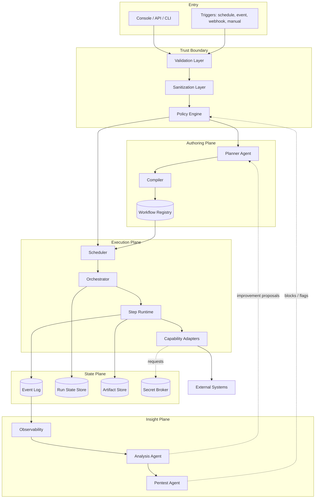

The system separates into four planes, and this separation is the single most important structural decision in the document:

| Plane | Owns | Trust posture | Failure impact |
|---|---|---|---|
| **Authoring plane** | Turning intent into a validated workflow artifact | AI-assisted, therefore untrusted; every output must pass the compiler and validator | Degraded authoring; running workflows unaffected |
| **Execution plane** | Running validated artifacts deterministically | No AI in the hot path; fully deterministic | Workflows stop running — this is the critical path |
| **State plane** | Durable facts: what ran, what it produced, what it consumed | Append-only, sanitised, auditable | Loss of auditability and recovery ability |
| **Insight plane** | Reading the state plane and reasoning about it | Read-only; may propose, may never mutate directly | Loss of learning and threat detection; execution unaffected |

**The Insight plane can never write to the Execution plane directly.** It emits proposals into the Authoring plane, which are validated like any other input. This is the structural expression of the "AI proposes, engine disposes" rule and the reason an AI failure cannot escalate into a production incident.

---

## 4. Architecture Layers

OmniFlow keeps the five layers defined in `ADR-0001` and adds one. The addition is deliberate and is the subject of `ADR-0002`.

| Layer | Inherited from ADR-0001 | Responsibility in OmniFlow |
|---|---|---|
| **Core** | Yes | Models, typed value objects, error taxonomy, logging and validation primitives. No business logic, no external calls. |
| **Modules** | Yes | Isolated functional units: registry, compiler, scheduler, orchestrator, analysis. |
| **Orchestration** | **New** | Workflow definition, planning, compilation, scheduling and step execution. Previously implicit inside "Modules"; now large enough to warrant its own boundary. |
| **Pipeline** | Yes | CI/CD, deterministic builds, artifact promotion, environment gates. Now also promotes *workflow* artifacts, not only code artifacts. |
| **Security** | Yes | Zero-trust validation, policy, secret brokering, pentest heuristics, risk scoring. |
| **Documentation** | Yes | Architecture, ADRs, generated workflow documentation, system flows. |

### 4.1 Dependency rule

Dependencies point **inward only**:

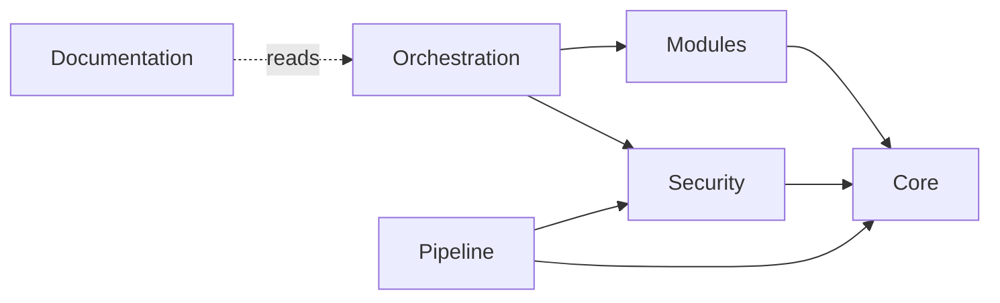

Rules, enforced by static analysis in CI:

- **Core depends on nothing.** A Core file that imports from any other layer is a build failure.
- **Security may be called from anywhere but calls only Core.** It evaluates and blocks; it never performs business logic. This is inherited verbatim from `docs/modules.md`.
- **Orchestration may not call Pipeline.** Automation triggering CI is done through a capability adapter like any other external system, not through a back door.
- **No cross-module state sharing.** Modules communicate through defined interfaces and the state plane, never through shared mutable memory.

---

## 5. Component Model

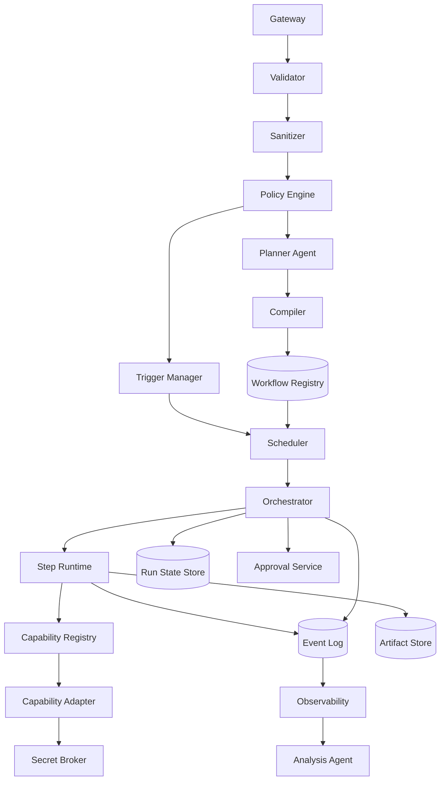

### 5.1 Component responsibilities

| # | Component | Responsibility | Explicit boundaries |
|---|---|---|---|
| 1 | **Gateway** | Sole entry point for humans and external systems. Authentication, rate limiting, request correlation ID assignment. | No business logic. No validation beyond transport-level. |
| 2 | **Validator** | Schema, type, range and pattern validation of every inbound payload and every workflow manifest. Fail-fast. | Cannot mutate data. Cannot make policy decisions. |
| 3 | **Sanitizer** | Normalisation, removal of unsafe content, redaction of sensitive fields before anything reaches logs. | Cannot reject — rejection is the Validator's job. |
| 4 | **Policy Engine** | Authorisation: may this principal run this workflow, in this environment, against these capabilities? Evaluates risk score from the Pentest Agent. | Cannot execute. Returns allow / deny / require-approval. |
| 5 | **Planner Agent** | Turns natural-language intent, an imported legacy workflow, or an improvement proposal into a **draft manifest**. | Output is always a draft. Never writes to the registry directly. Never executes. |
| 6 | **Compiler** | Deterministically transforms a manifest into an immutable **execution plan**: resolved capability versions, expanded templates, topologically sorted DAG, static guard checks. | Pure function. Same manifest plus same registry state yields byte-identical plan. |
| 7 | **Workflow Registry** | Immutable, content-addressed store of published workflow versions with lineage, owner, and approval record. | Append-only. Published versions are never edited, only superseded. |
| 8 | **Trigger Manager** | Owns schedules, event subscriptions, webhook endpoints and manual invocations. Converts a trigger firing into a run request. | Does not decide whether the run is permitted — asks the Policy Engine. |
| 9 | **Scheduler** | Decides *when* and *whether* a run starts. Concurrency limits, queues, priorities, backpressure, deduplication windows. | Does not know what steps do. |
| 10 | **Orchestrator** | Owns the run state machine: which steps are ready, dispatching them, applying retry and compensation policy, persisting checkpoints. | Never calls an external system directly. |
| 11 | **Step Runtime** | Executes exactly one step in an isolated sandbox with a time and resource budget. Emits events. | Stateless between steps. Cannot reach the network except through a Capability Adapter. |
| 12 | **Capability Registry** | Catalogue of available capabilities: name, semantic version, typed input/output schema, declared side effects, required scopes, idempotency characteristics. | Purely declarative metadata. |
| 13 | **Capability Adapter** | The only component permitted to touch an external system. Maps typed input to a protocol call and back. | One adapter, one external system. No business logic, no orchestration. |
| 14 | **Secret Broker** | Issues short-lived, narrowly scoped credentials to an adapter for the duration of one step. | Secrets never enter the manifest, the plan, the state store, or the event log. |
| 15 | **Run State Store** | Durable current state of every run and step: status, attempt count, checkpoints, outputs by reference. | Not a general-purpose database for user data. |
| 16 | **Event Log** | Append-only, sanitised, schema-enforced record of everything that happened. The audit trail and the replay source. | Immutable. No deletes, no updates. |
| 17 | **Artifact Store** | Content-addressed storage for step payloads too large or too sensitive to inline (files, reports, datasets). | Referenced by hash from the state store; never inlined into the event log. |
| 18 | **Approval Service** | Human-in-the-loop gates: routes an approval request, waits, records the decision with identity and timestamp. | Cannot resume a run itself — it emits a decision event the Orchestrator consumes. |
| 19 | **Observability** | Metrics, traces, structured log aggregation, dashboards, alerting on SLOs. | Read-only over the event log. |
| 20 | **Analysis Agent** | Reads history: detects failure patterns, cost hotspots, redundant workflows, drift. Emits improvement proposals. | Read-only. Proposals enter through the Authoring plane. |
| 21 | **Pentest Agent** | Applies the heuristics of `docs/pentest-flow.md` to manifests, plans and run history. Produces risk scores and blocking findings. | May block via the Policy Engine; may never edit a workflow. |
| 22 | **Documentation Agent** | Generates and maintains human-readable documentation of every published workflow and of the platform itself. | Documentation only. |

---

## 6. The Workflow Model

This section is the specification a developer implements first. Everything else is scaffolding around it.

### 6.1 Three artifacts, three lifecycles

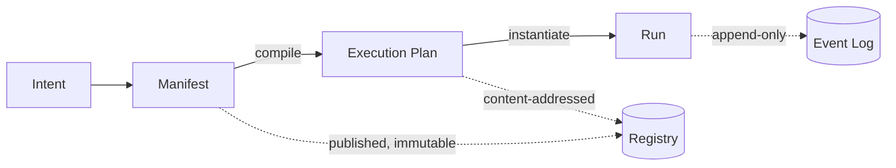

| Artifact | Mutability | Produced by | Consumed by |
|---|---|---|---|
| **Manifest** | Mutable while draft; immutable once published | Human author or Planner Agent | Compiler |
| **Execution Plan** | Always immutable, content-addressed by hash | Compiler | Scheduler, Orchestrator |
| **Run** | Mutable state machine; its history is append-only | Orchestrator | Observability, Analysis |

The separation between manifest and plan matters more than it appears. It is what allows a workflow to be reviewed as a human-readable document while being executed as a fully resolved, unambiguous graph — and what makes "why did last Tuesday's run behave that way?" answerable, because the exact plan hash is recorded on the run.

### 6.2 Manifest anatomy

A manifest is a declarative document (YAML for authoring, JSON for transport — the same schema). Its top-level sections:

| Section | Required | Purpose |
|---|---|---|
| `apiVersion` | yes | Manifest schema version. Enables forward migration. |
| `kind` | yes | `Workflow`, `Capability`, or `Policy`. |
| `metadata` | yes | Name (kebab-case), version (semver), owner, team, description, labels, criticality tier. |
| `triggers` | yes | One or more of: schedule, event subscription, webhook, manual, workflow-completion. |
| `inputs` | yes | Typed input schema with defaults, constraints and sensitivity flags. |
| `context` | no | Read-only environment facts injected at compile time (environment name, region, feature flags). |
| `steps` | yes | The nodes of the DAG. See §6.3. |
| `edges` | implicit | Derived from `dependsOn` declarations on steps; the compiler builds and validates the DAG. |
| `guards` | no | Preconditions that must hold before the run starts, and invariants checked between steps. |
| `outputs` | no | Typed values the workflow publishes on success. |
| `policy` | no | Retry defaults, timeout defaults, concurrency limits, required approvals, data-residency constraints. |
| `observability` | no | Custom SLO thresholds, alert routing, business metrics to emit. |

Everything not in the schema is a validation error. There is no escape hatch for arbitrary expressions beyond a small, sandboxed expression language for conditions — deliberately not Turing-complete.

### 6.3 The step contract

Every step, regardless of type, honours one contract:

| Field | Meaning |
|---|---|
| `id` | Unique within the workflow, kebab-case, stable across versions. Renaming an id is a breaking change. |
| `type` | `capability`, `branch`, `parallel`, `map`, `approval`, `wait`, `subworkflow`, or `terminate`. |
| `uses` | For `capability` steps: the capability name and version constraint. |
| `with` | Typed inputs, built from workflow inputs, context and prior step outputs. |
| `dependsOn` | Step ids that must reach a terminal successful state first. Defines the DAG edges. |
| `when` | Optional condition from the sandboxed expression language. Evaluated once, at dispatch. |
| `timeout` | Wall-clock budget. Mandatory; the compiler injects the policy default if absent. |
| `retry` | Attempts, backoff strategy, and which error classes are retryable. |
| `idempotencyKey` | Expression producing a stable key. Required for any step whose capability declares a side effect. |
| `compensate` | Optional reference to a capability that undoes this step's effect during rollback. |
| `onError` | `fail`, `continue`, `compensate`, or `route-to` another step. |
| `produces` | Typed output schema. The compiler verifies downstream consumers against it. |
| `sensitivity` | `public`, `internal`, `confidential`, `secret`. Drives redaction and residency rules. |

### 6.4 Step types

| Type | Semantics | Notes |
|---|---|---|
| `capability` | Invoke one capability adapter. The only step type that can reach the outside world. | The workhorse. |
| `branch` | Choose one of N successor paths by condition. | Exhaustive: an unmatched branch is a validation error unless a default exists. |
| `parallel` | Fan out to a fixed set of named sub-branches, join on all or on first success. | Join policy is explicit. |
| `map` | Fan out over a collection with a bounded concurrency and an error tolerance threshold. | Guards against unbounded fan-out at compile time. |
| `approval` | Suspend, request a human decision, resume on the recorded decision. | Timeout behaviour must be declared: escalate, deny, or approve-by-default (the last requires a justification field). |
| `wait` | Suspend until a duration elapses or an external event arrives. | Durable — surviving a process restart is a correctness requirement. |
| `subworkflow` | Invoke another published workflow version as a step. | Version-pinned. Recursion depth is bounded at compile time. |
| `terminate` | End the run early with a declared status. | Explicit success or explicit, classified failure. |

### 6.5 Determinism, idempotency and time

Three rules make replay and retry safe, and they must be enforced by the compiler rather than left to authors:

1. **No hidden time.** A step may not read the clock. Time enters through `context.now`, fixed at run start and recorded on the run. A step needing "current time" is reading a value, not a moving target.
2. **No hidden randomness.** Random values, UUIDs and sampling decisions come from a seeded generator whose seed is part of the run record.
3. **Side effects declare idempotency.** A capability declares itself `pure`, `idempotent`, or `effectful`. An `effectful` capability used without an `idempotencyKey` is a compile error. This single rule removes the majority of duplicate-charge, duplicate-email and duplicate-ticket incidents that plague retry-capable systems.

### 6.6 Versioning and compatibility

| Change | Semver impact | Requires |
|---|---|---|
| Adding an optional input with a default | Minor | Review |
| Adding a step that has no external effect | Minor | Review |
| Changing a step `id`, an input type, or an output shape | Major | Review, ADR reference if it changes a contract others depend on |
| Adding or changing an `effectful` capability | Major | Review plus Pentest Agent sign-off |
| Editing a published version in place | **Forbidden** | Publish a new version |

Running workflows always complete against the plan they started with. Version pinning at the `subworkflow` boundary means an upstream publish never silently changes downstream behaviour.

---

## 7. Capability Model — How the System Touches the World

A **capability** is the unit of integration. It is the only path from OmniFlow to anything external, and it is what makes the system genuinely able to absorb arbitrary workflows: replacing a new class of workflow means writing an adapter, not changing the engine.

### 7.1 Capability declaration

| Field | Purpose |
|---|---|
| `name` / `version` | Kebab-case identity, semver. |
| `inputSchema` / `outputSchema` | Typed contract enforced by the Validator on both directions. |
| `effect` | `pure`, `idempotent`, or `effectful`. Drives idempotency-key enforcement. |
| `scopes` | The permissions the adapter requires. The Secret Broker issues only these. |
| `egress` | Explicit allow-list of hosts and ports. Anything else is blocked at the sandbox boundary. |
| `costModel` | Declared cost per invocation (monetary, rate-limit units, or latency class) for scheduling and analysis. |
| `failureModes` | Enumerated error classes with retryability, so the Orchestrator does not guess. |
| `compensation` | The capability, if any, that reverses this one. |
| `dataClassification` | Highest sensitivity of data this capability may handle. |

### 7.2 Capability families to ship

Ordered by how much workflow surface each one absorbs:

| Family | Absorbs | Priority |
|---|---|---|
| HTTP / REST client | The long tail of SaaS and internal APIs | P0 |
| Shell / script executor (sandboxed, allow-listed) | Existing cron scripts, PowerShell and Python automation | P0 |
| Database query and command | Reporting, reconciliation, data movement | P0 |
| Object storage and file operations | Document pipelines, report distribution | P0 |
| Message and notification (email, chat, ticketing) | Alerting, handoffs, approvals fallback | P1 |
| LLM inference | Classification, extraction, summarisation, drafting *inside* a workflow | P1 |
| Source control and CI trigger | Release and infrastructure automation | P1 |
| Identity and directory | Onboarding, offboarding, access review | P2 |
| Spreadsheet and document generation | Finance, compliance, reporting | P2 |

The **shell executor** deserves emphasis: it is the migration bridge. It lets an existing script run unmodified as a step on day one, under supervision, with observability and retry policy it never had — and lets it be decomposed into typed capabilities later, when there is time. Without it, migration stalls. With it, it can be incremental. It is also the highest-risk capability in the system, which is why §11.4 constrains it specifically.

### 7.3 The LLM as a capability, not as the engine

An `llm-inference` capability is an ordinary step: typed input, typed output, schema-validated response, bounded cost, declared as `effectful` when it can act. Model non-determinism is contained by validating the output against a schema and by treating a schema violation as a normal, retryable failure.

This is the difference between "AI in the workflow" and "AI as the workflow". OmniFlow allows the former everywhere and permits the latter only in the Authoring plane, where a human or a validator reviews the result before it can run.

---

## 8. AI Agent Model

OmniFlow inherits the multi-agent model of `docs/agent-workflow.md` and extends it from repository maintenance into runtime operation. Agents obey the safety rules of `docs/agent-safety.md` without exception.

### 8.1 Agent roster

| Agent | Plane | Input | Output | May write to |
|---|---|---|---|---|
| **Planner Agent** | Authoring | Natural-language intent, an imported legacy workflow, or an improvement proposal | Draft manifest with rationale and open questions | Draft store only |
| **Architecture Agent** | Authoring | Manifest set, capability registry | Structural findings, decomposition proposals, diagrams | Documentation, draft proposals |
| **Analysis Agent** | Insight | Event log, run history, cost data | Failure patterns, redundancy findings, optimisation proposals | Proposal queue only |
| **Pentest Agent** | Insight / Security | Manifests, plans, run history, logs | Risk scores, blocking findings, threat models | Policy findings; blocks via Policy Engine |
| **Documentation Agent** | Documentation | Published workflows, ADRs, architecture | Human-readable docs, diagrams, changelogs | Documentation only |
| **Refactor Agent** | Authoring | Existing manifests plus Analysis findings | Multi-file refactoring plan and draft manifests | Draft store only |

### 8.2 The invariant

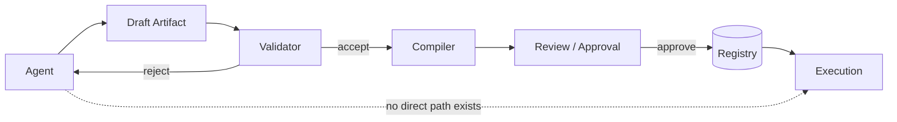

**No agent output reaches execution without passing the same validation and approval path as a human's.** An agent has no privileged channel. This is what makes an AI-authored workflow no more dangerous than a human-authored one — and it is auditable, because the draft, the findings and the approval are all recorded.

### 8.3 Autonomy tiers

Full autonomy everywhere is neither desirable nor necessary. Autonomy is a per-workflow, per-environment setting:

| Tier | Agent may | Human must |
|---|---|---|
| **T0 — Advisory** | Propose only; nothing is applied | Author and approve everything |
| **T1 — Assisted** | Draft manifests and refactorings | Review and approve every publish |
| **T2 — Supervised** | Publish to non-production; auto-open a change request for production | Approve the production promotion |
| **T3 — Autonomous (bounded)** | Publish and run in production within a declared blast radius: no `effectful` capabilities above a cost ceiling, no `confidential` data, reversible steps only | Review after the fact; may revoke |

T3 is deliberately narrow. The default for a new workflow is T1, and promotion between tiers is a governed decision recorded like any other.

### 8.4 Prompt-injection posture

An agent reading run history, external documents or capability responses is reading **attacker-influenced content**. Therefore:

- Content retrieved at runtime is always framed as data, never as instructions.
- No agent has direct execution privileges, so a successful injection yields at most a *proposal* — which is then validated, risk-scored and reviewed.
- The Pentest Agent specifically scans drafts for injected instruction patterns, unexpected capability additions and egress expansion.
- Capability responses that will be shown to an agent are sanitised on the way into the event log, per `docs/data-flow.md`.

---

## 9. Execution Lifecycle

### 9.1 End-to-end sequence

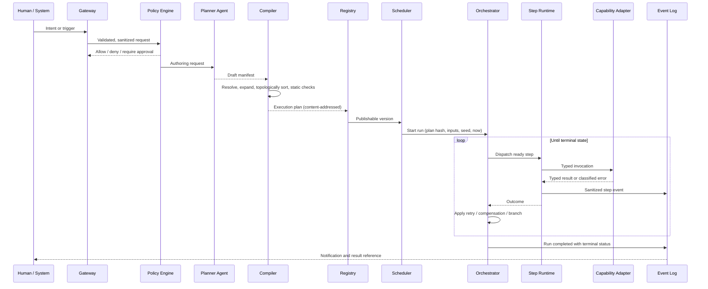

### 9.2 Run state machine

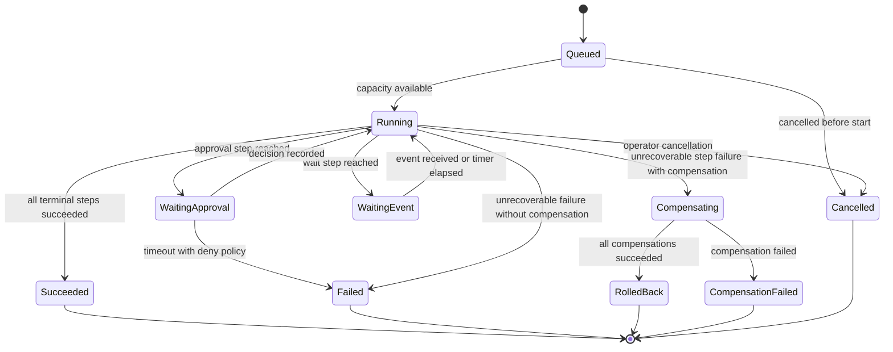

`CompensationFailed` is a distinct terminal state, not a variant of `Failed`. It means the system knows it left the world in an inconsistent condition. It must page a human. Collapsing it into `Failed` would hide exactly the class of incident that most needs attention.

### 9.3 Step attempt lifecycle

| Phase | Action | Failure handling |
|---|---|---|
| Ready | Dependencies satisfied, `when` condition true | Condition false → step skipped, marked `Skipped`, downstream re-evaluated |
| Admitted | Concurrency and rate budget available | No budget → remains queued, does not consume an attempt |
| Prepared | Inputs resolved and validated against the capability schema | Validation failure → immediate non-retryable failure |
| Authorised | Policy check, secret lease issued | Denied → non-retryable failure with an audit event |
| Executing | Adapter invoked inside the sandbox with timeout | Timeout → retryable failure |
| Validated | Output validated against `produces` | Schema violation → retryable once, then non-retryable |
| Recorded | Output persisted, event emitted, secret lease revoked | Persistence failure → retry with the same idempotency key |

The lease revocation in the final phase is not optional. A credential outliving the step that needed it is the most common way a bounded system becomes an unbounded one.

---

## 10. Data Flow and Contracts

Consistent with `docs/data-flow.md`, no raw input travels past validation and no sensitive data reaches a log.

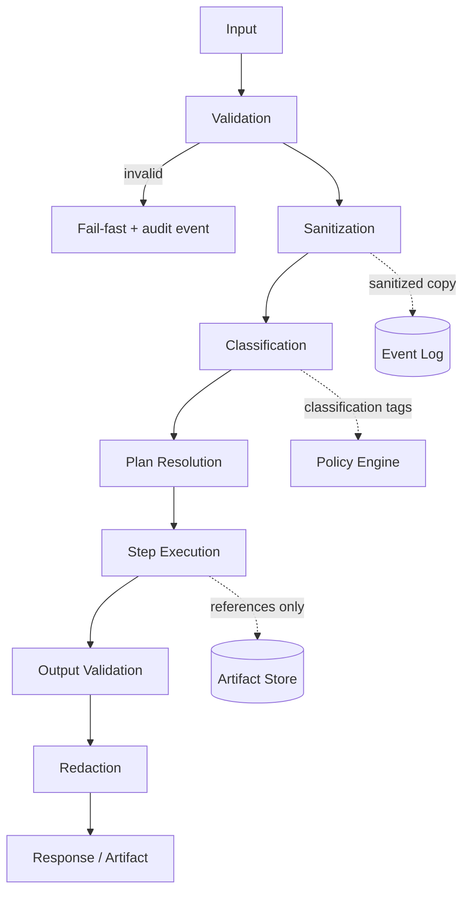

### 10.1 Data handling rules

| Rule | Rationale |
|---|---|
| All inputs are untrusted, including capability responses | An external system is not a trusted peer |
| Payloads above a size threshold are stored in the artifact store and referenced by hash | Keeps the event log small, cheap and replayable |
| Classification is assigned at ingress and travels with the value | Redaction and residency cannot be decided later if the tag is lost |
| `secret`-classified values never leave the Secret Broker's lease scope | Prevents the classic leak into logs and state |
| The event log is append-only and schema-enforced | Audit integrity; enables replay |
| Right-to-erasure is served by tombstoning artifacts, never by rewriting the event log | Preserves the audit chain while honouring deletion of the payload |

### 10.2 Core contracts a developer must implement first

| Contract | Consumers | Stability requirement |
|---|---|---|
| Manifest schema | Authors, Planner, Compiler, Validator | Versioned, backward-compatible within a major version |
| Execution plan schema | Compiler, Scheduler, Orchestrator | Internal but versioned; plan hash is part of the audit record |
| Capability contract | Adapters, Registry, Runtime | The public extension point — the most important contract in the system |
| Event schema | Runtime, Orchestrator, Observability, Analysis, Pentest | Append-only; new fields optional, existing fields never repurposed |
| Policy decision contract | Gateway, Scheduler, Runtime | Small and total: allow, deny, require-approval, with a reason code |

---

## 11. Security Model

Zero-trust, per `ADR-0001` and `docs/pentest-flow.md`, applied to the specific shape of a workflow engine.

### 11.1 Trust boundaries

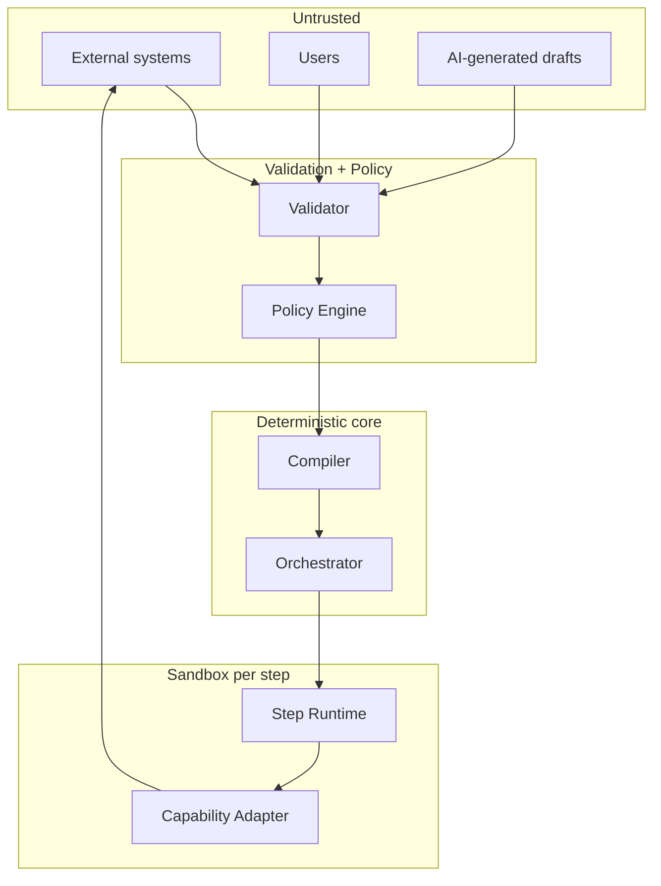

Note that **AI-generated drafts sit on the untrusted side of the boundary**, alongside external systems and user input. This placement is the security posture of the entire product in one line.

### 11.2 Threat model summary

| # | Threat | Vector | Control |
|---|---|---|---|
| T1 | Malicious or mistaken workflow causes destructive external action | Authoring | Static analysis at compile time, capability scopes, blast-radius policy, approval gates for `effectful` steps |
| T2 | Prompt injection steers the Planner | Untrusted content in context | Content-as-data framing, no execution privilege for agents, Pentest scan of drafts, human approval below T3 |
| T3 | Secret leakage | Logs, state, manifests, artifacts | Secret Broker with short-lived leases, classification-driven redaction, secret scanning in CI, no secrets in manifests |
| T4 | Sandbox escape from a shell step | Shell executor capability | Container isolation, read-only root, no privilege escalation, seccomp profile, egress allow-list, resource caps |
| T5 | Privilege escalation through capability composition | Chaining low-risk steps to a high-risk effect | Policy evaluated on the whole plan, not per step; cumulative-scope analysis at compile time |
| T6 | Replay or forgery of a trigger | Webhook endpoints | Signature verification, nonce and timestamp windows, per-source rate limits |
| T7 | Tampering with audit history | State plane | Append-only storage, hash chaining, separate retention credentials |
| T8 | Denial of service via fan-out | `map` or `parallel` step | Compile-time fan-out bounds, per-tenant concurrency quotas, cost ceilings, circuit breakers |
| T9 | Supply-chain compromise of an adapter | Third-party dependency | Pinned dependencies, dependency audit in CI, signed capability artifacts, adapter allow-list per environment |
| T10 | Data residency or classification violation | Cross-region capability | Classification tags evaluated by the Policy Engine before dispatch; region-scoped capability registration |

### 11.3 Least privilege in practice

- A step receives a credential scoped to **one capability, one operation, one run, one time window**.
- Egress is denied by default. A capability's declared `egress` allow-list is the only permitted destination set.
- The Orchestrator has no external network access at all — a deliberate structural constraint, since it holds the most authority.
- Production capability registration requires a named owner and a Pentest Agent review.

### 11.4 Constraining the shell executor

The shell executor is the migration bridge (§7.2) and the largest single risk. It is therefore constrained beyond ordinary capabilities:

| Constraint | Requirement |
|---|---|
| Image | Pinned, minimal, scanned; no package installation at runtime |
| Filesystem | Read-only root; a single writable scratch mount discarded at step end |
| Network | Denied unless an explicit host allow-list is declared on the step |
| Credentials | Injected by lease only; the environment is scrubbed of everything else |
| Command | Declared as an argument vector, never as a shell string, to eliminate the injection class entirely |
| Approval | Any production shell step requires a named owner and, on first publish, a human approval |
| Sunset | Every shell step carries a review date; the Analysis Agent reports on shell steps that have outlived it |

That last row is what prevents the bridge from quietly becoming the destination.

---

## 12. Reliability and Failure Model

### 12.1 Guarantees

| Guarantee | Level | Mechanism |
|---|---|---|
| Run durability | A run accepted by the Scheduler survives process and node restart | Checkpointed state, durable queue |
| Step execution | At-least-once | Retry with idempotency keys |
| Effective exactly-once | For `idempotent` capabilities only, and only with a correct key | Idempotency key enforcement at compile time |
| Ordering | Per-run causal ordering, guaranteed by DAG edges | Topological dispatch |
| Recovery point | Last completed step | Checkpoint after each step, not each run |

### 12.2 Failure classification

| Class | Examples | Default handling |
|---|---|---|
| Transient | Network timeout, HTTP 429/503, lock contention | Retry with exponential backoff and jitter |
| Contract | Schema violation, type mismatch | One retry, then fail non-retryably; the manifest is wrong |
| Authorisation | Policy denial, expired lease | Fail immediately, audit event, no retry |
| Business | Capability succeeded but returned a domain rejection | Route via `onError`; not a system failure |
| Systemic | Adapter unavailable, dependency circuit open | Pause the affected steps, alert, resume automatically on recovery |
| Catastrophic | Compensation failed, data inconsistency detected | Terminal `CompensationFailed`, page a human, freeze the workflow version |

### 12.3 Blast-radius controls

- Per-workflow and per-tenant concurrency quotas.
- Circuit breakers per capability, tripping on error rate and latency.
- Cost ceilings per run and per workflow per day, enforced by the Scheduler using the capability `costModel`.
- Canary publishing: a new workflow version takes a declared percentage of runs before full promotion.
- A global kill switch per workflow and per capability, exercised in drills rather than discovered during incidents.

---

## 13. Observability and the Learning Loop

### 13.1 What is measured

| Level | Signals |
|---|---|
| Run | Duration, terminal status, cost, steps executed, retries, approval wait time |
| Step | Latency distribution, error class breakdown, retry count, payload size |
| Capability | Availability, latency, error rate, cost, circuit state |
| Workflow | Success rate trend, cost trend, drift from the previous version, manual-intervention rate |
| Platform | Queue depth, scheduling latency, worker saturation, event-log lag |
| Business | Metrics the workflow itself declares in its `observability` section |

The **manual-intervention rate** deserves attention: it is the honest measure of whether a workflow has genuinely replaced work or merely relocated it.

### 13.2 The learning loop

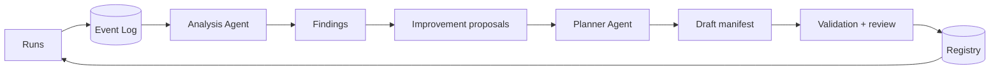

Findings the Analysis Agent is expected to produce:

- steps that always succeed and could be removed, or always fail and are being ignored,
- retry storms indicating a mis-classified error type,
- near-duplicate workflows that should become one parameterised workflow,
- cost hotspots and their cheaper alternatives,
- approval gates that are approved 100% of the time (candidates for removal) or denied often (candidates for an earlier guard),
- shell steps past their sunset date,
- schedule drift and queue starvation.

Every finding is a proposal, never an edit. The loop closes through review, which is what makes it safe to run continuously.

---

## 14. Migration Path — Replacing Existing Workflows

"Replace any workflow" is achieved by sequencing, not by a big bang.

### 14.1 Inventory and triage

| Step | Output |
|---|---|
| Discover | A register of every scheduled task, script, low-code automation and runbook, with owner, trigger, frequency and criticality |
| Classify | Each entry tagged by complexity (steps, branches, integrations) and risk (`effectful`, data classification, blast radius) |
| Prioritise | Rank by *frequency × pain ÷ risk*. High-frequency, high-pain, low-risk items first |
| Select the beachhead | 5–10 workflows that exercise at least three distinct capability families |

### 14.2 The four migration patterns

| Pattern | When to use | Effort | Fidelity |
|---|---|---|---|
| **Lift** — run the existing script as a single shell step | Legacy script, unclear logic, low change rate | Hours | Behaviour identical; observability improves immediately |
| **Wrap** — split into a few shell steps with typed boundaries between them | Script with clear phases | Days | Retry and partial recovery become possible |
| **Decompose** — replace shell steps with typed capabilities one at a time | Business-critical, frequently changed | Weeks | Full determinism, testability, reuse |
| **Rebuild** — author a new manifest from intent | Original is a manual runbook, or the process is being redesigned anyway | Days to weeks | Highest quality; requires domain input |

Most workflows should travel **Lift → Wrap → Decompose**, and it is legitimate for a low-value workflow to stop at Lift permanently. Forcing decomposition everywhere is how migration programmes stall.

### 14.3 Cutover protocol

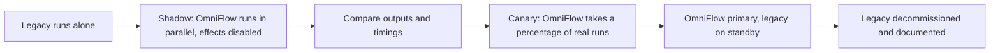

Shadow mode requires capability adapters to honour a **dry-run flag** that suppresses external effects while still exercising the full path. Building that flag into the adapter contract from day one is far cheaper than retrofitting it, and it is what makes safe cutover possible at all.

---

## 15. CI/CD and Testing Strategy

Per `docs/ci-cd.md`: deterministic builds, fail-fast, security-first, immutable artifacts. OmniFlow extends the pipeline to treat **workflow manifests as first-class build artifacts**.

### 15.1 Pipeline

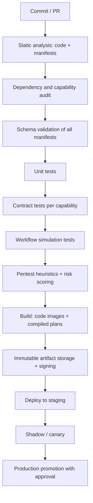

### 15.2 Test pyramid

| Level | Scope | Determinism requirement |
|---|---|---|
| Unit | Pure functions in Core, expression evaluation, DAG construction | Fully deterministic |
| Contract | Each capability adapter against a recorded or sandbox external system | Recorded fixtures; live tests run nightly, not per PR |
| Compilation | Manifest → plan, asserting the exact plan hash for a fixture set | Byte-identical output required; a diff is a regression |
| Simulation | Whole workflow executed against mocked capabilities, asserting the visited path and outputs | Seeded; no wall-clock dependence |
| Integration | Engine plus real state plane in containers | Deterministic modulo timing |
| Chaos | Injected adapter failures, timeouts, worker kills mid-step | Asserts recovery, not exact timing |
| Security | Injection corpora, escape attempts, scope-escalation attempts, secret-leak scans | Must pass; critical findings block promotion |

Two properties are worth calling out because they catch entire classes of defect cheaply. **Plan-hash assertions** turn "did anyone accidentally change compilation semantics?" into a one-line test failure. **Simulation tests** let a workflow be tested as thoroughly as application code — which, for a system whose purpose is to hold business processes, is the whole point.

Coverage thresholds inherit the repository standard: 80% minimum, 90% for Core, Compiler, Orchestrator and Policy Engine.

---

## 16. Repository Structure

Following the repository naming conventions: folders and files in `kebab-case`.

```
/
├─ .github/
│  ├─ copilot-instructions.md
│  ├─ agents/
│  │   ├─ architecture.agent.md
│  │   ├─ documentation.agent.md
│  │   ├─ pentest.agent.md
│  │   ├─ planner.agent.md
│  │   └─ analysis.agent.md
│  └─ workflows/                  # CI/CD pipeline definitions
├─ .copilot/
│  └─ prompts/
│      ├─ architecture.prompt.md
│      ├─ documentation.prompt.md
│      ├─ refactor.prompt.md
│      └─ workflow-authoring.prompt.md
├─ core/                          # models, errors, validation + logging primitives
├─ orchestration/
│  ├─ registry/
│  ├─ compiler/
│  ├─ scheduler/
│  ├─ orchestrator/
│  └─ runtime/
├─ capabilities/
│  ├─ contract/                   # the capability contract + registry
│  └─ adapters/
│      ├─ http/
│      ├─ shell/
│      ├─ database/
│      ├─ storage/
│      ├─ notification/
│      └─ llm/
├─ security/
│  ├─ policy/
│  ├─ secret-broker/
│  └─ pentest/
├─ insight/
│  ├─ observability/
│  └─ analysis/
├─ schemas/                       # manifest, plan, event, capability, policy schemas
├─ workflows/                     # published workflow manifests (the company's processes)
├─ deploy/                        # compose files, container definitions, environment config
├─ tests/
└─ docs/
   ├─ architecture.md
   ├─ system-overview.md
   ├─ modules.md
   ├─ data-flow.md
   ├─ component-diagram.md
   ├─ agent-workflow.md
   ├─ agent-safety.md
   ├─ agent-context.md
   ├─ pentest-flow.md
   ├─ ci-cd.md
   ├─ workflow-authoring-guide.md
   └─ adr/
       ├─ ADR-0001-core-architecture.md
       └─ ADR-0002-workflow-execution-model.md
```

The `workflows/` directory is where the company's processes live as reviewable text. Over time it becomes the most valuable directory in the repository — the executable answer to "what does this company actually do".

---

## 17. Build Roadmap

Each phase ends with something that works and can be demonstrated. No phase depends on a later phase's existence.

### Phase 0 — Walking Skeleton

**Goal:** one trivial workflow runs end to end and is observable.

| Deliverable | Definition of done |
|---|---|
| Manifest schema v0 | Linear steps, typed inputs and outputs, no branching |
| Validator | Rejects malformed manifests with precise, positional errors |
| Compiler v0 | Manifest → plan, topological sort, deterministic hash |
| Orchestrator v0 | Sequential execution, no retry, checkpoint after each step |
| HTTP capability | One adapter, typed contract, dry-run flag honoured |
| Event log | Append-only, schema-enforced, sanitised |
| CLI | Validate, compile, run, tail a run's events |
| Container deployment | Compose file brings the whole thing up on one machine |

**Exit criterion:** a manifest calling two HTTP endpoints in sequence runs, and its complete history is reconstructable from the event log alone.

### Phase 1 — A Real Engine

**Goal:** workflows that a team would actually trust with a nightly job.

| Deliverable | Definition of done |
|---|---|
| DAG execution | `parallel`, `branch`, `dependsOn`, correct join semantics |
| Retry and timeout | Error classification, backoff with jitter, per-step budgets |
| Idempotency enforcement | `effectful` without a key is a compile error |
| Trigger Manager | Cron schedules and webhooks with signature verification |
| Scheduler | Concurrency limits, queueing, deduplication window |
| Registry | Immutable versioned publishing with lineage |
| Shell and database capabilities | Sandboxed shell per §11.4; parameterised database access |
| Secret Broker | Short-lived leases, revoked at step end |
| Console v0 | Run list, run detail, step timeline, log view |

**Exit criterion:** five real workflows migrated by the Lift pattern run on schedule for two weeks with no manual intervention.

### Phase 2 — Safety and Scale

**Goal:** production-grade behaviour under failure and load.

| Deliverable | Definition of done |
|---|---|
| Compensation and rollback | `compensate`, `Compensating` and `CompensationFailed` states implemented and drilled |
| `approval`, `wait`, `map`, `subworkflow` | Durable suspension surviving restart; bounded fan-out |
| Policy Engine | RBAC, environment gates, cumulative-scope analysis over the whole plan |
| Pentest Agent | Heuristics over manifests, plans and history; risk scores blocking promotion |
| Observability | Metrics, distributed traces, SLOs, alerting |
| Chaos and recovery tests | Worker kill mid-step recovers without duplicate effects |
| Cost model | Per-run and per-workflow ceilings enforced by the Scheduler |

**Exit criterion:** a deliberately induced adapter outage degrades gracefully, recovers automatically, and produces no duplicate external effects.

### Phase 3 — The AI Layer

**Goal:** authoring by intent, with the safety invariant intact.

| Deliverable | Definition of done |
|---|---|
| Planner Agent | Intent → draft manifest; every draft passes the same validation path as a human's |
| Legacy importer | Ingests a script or an exported low-code automation and proposes a Lift or Wrap manifest |
| Analysis Agent | Findings from run history; proposals into the queue, never into the registry |
| Explanation | Plain-language description of any workflow and any run, generated from the plan and event log |
| Autonomy tiers | T0–T3 configurable per workflow and environment; T1 default |
| LLM capability | Schema-validated inference as an ordinary step |
| Injection defence | Content-as-data framing; Pentest scanning of drafts; corpus-based tests in CI |

**Exit criterion:** a non-developer describes a process in prose and, after review, a correct workflow is published — and an attempt to inject instructions through capability output produces a blocked draft rather than an execution.

### Phase 4 — Platform

**Goal:** many teams, many environments, self-service.

| Deliverable | Definition of done |
|---|---|
| Multi-tenancy | Isolation of state, secrets, quotas and capability registration per team |
| Capability marketplace | Internal teams publish signed adapters against the contract |
| Visual authoring | Bidirectional graph editor over the manifest — the manifest remains the source of truth |
| Canary and progressive rollout | Percentage-based promotion with automatic rollback on SLO breach |
| Optional Kubernetes deployment | Horizontal scaling of runtime workers; the container contract is unchanged from Phase 0 |
| Compliance pack | Retention policies, residency enforcement, audit export, evidence generation |

**Exit criterion:** a team unfamiliar with the platform onboards, publishes a production workflow and operates it without the platform team's involvement.

---

## 18. Sizing, Team and Effort

Indicative, for a competent team building against this document. Actuals depend on the capability surface required.

| Phase | Duration | Team | Primary risk |
|---|---|---|---|
| 0 | 2–4 weeks | 1–2 engineers | Over-designing the manifest schema before it has run anything |
| 1 | 6–10 weeks | 2–3 engineers | Retry and idempotency semantics being bolted on rather than designed in |
| 2 | 8–12 weeks | 3–4 engineers plus security review | Compensation being harder than expected; state-plane correctness |
| 3 | 6–10 weeks | 2–3 engineers plus an AI-focused engineer | Autonomy creeping ahead of the validation invariant |
| 4 | Ongoing | 4–6 engineers | Multi-tenancy retrofitted rather than designed for |

Two decisions dominate the schedule, and both are made in Phase 0:

1. **The manifest schema.** It is the public contract. Getting the step contract, the effect classification and the idempotency rules right early avoids a migration of every workflow later. Keep the schema *small* in Phase 0 — it is easier to add a field than to remove one.
2. **The capability contract.** Every integration ever written depends on it. Include the dry-run flag, the effect classification and the failure-mode enumeration from the first adapter, even though none of them are needed on day one.

---

## 19. Risks and Mitigations

| # | Risk | Impact | Likelihood | Mitigation |
|---|---|---|---|---|
| R1 | Manifest schema becomes a programming language by accretion | Loses reviewability and static analysability — the core value proposition | High | Non-Turing-complete expressions; logic beyond a threshold must move into a capability; schema changes require an ADR |
| R2 | Shell steps become permanent | System becomes an expensive cron with extra steps | High | Sunset dates, Analysis Agent reporting, decomposition budget in each quarter |
| R3 | AI authoring is trusted beyond its reliability | Incorrect workflows reach production | Medium | T1 default, validation invariant, approval gates, blast-radius limits on T3 |
| R4 | Single engine becomes a single point of failure | Company-wide automation outage | Medium | Stateless horizontally scalable workers, durable queues, per-workflow kill switches, tested restore procedure |
| R5 | Capability sprawl with inconsistent quality | Unreliable integrations, duplicated adapters | Medium | Capability contract conformance suite, signing, ownership requirement, review before production registration |
| R6 | Migration stalls after the beachhead | Two systems to operate indefinitely | Medium | Explicit decommissioning criteria per workflow; migration progress tracked as a first-class metric |
| R7 | Event log growth becomes unaffordable | Cost pressure to weaken the audit trail | Medium | Tiered retention, artifact offload, sampling of non-critical step detail — never of terminal events |
| R8 | Compensation logic is written but never exercised | Rollback fails when first needed | High | Compensation paths covered by chaos tests; unexercised compensation flagged by the Analysis Agent |
| R9 | Over-abstraction in Phase 0 delays first value | Loss of momentum and sponsorship | Medium | Walking skeleton discipline; every phase ships something demonstrable |
| R10 | Secrets leak through an adapter's error message | Credential compromise | Medium | Classification-driven redaction applied to error paths as well as success paths; secret scanning over the event log in CI |

R8 deserves emphasis: compensation code is, by construction, the code that runs least often and matters most. Treating "has this compensation path ever actually executed in a test?" as a release gate is cheap insurance.

---

## 20. Open Questions

These require a decision before or during Phase 1 and should each end in an ADR.

| # | Question | Why it matters |
|---|---|---|
| Q1 | Manifest authoring format — YAML only, or YAML with a typed schema-generation path? | Affects tooling, editor support and validation ergonomics |
| Q2 | State plane technology — relational store, or a dedicated durable-execution engine? | Build-versus-buy decision with large schedule implications |
| Q3 | Expression language — adopt an existing sandboxed language or define a minimal one? | Adoption cost versus control over the non-Turing-complete guarantee |
| Q4 | Step isolation — container per step, or a pooled worker with in-process sandboxing? | Trades latency and cost against isolation strength |
| Q5 | Multi-tenancy — designed in from Phase 1 or retrofitted at Phase 4? | Retrofitting isolation is historically expensive |
| Q6 | Event log retention and residency defaults | Compliance obligations and cost |
| Q7 | Does the visual editor edit the manifest bidirectionally, or is it view-only? | Bidirectional editing constrains the schema permanently |
| Q8 | Which model or models back the Planner, and is inference self-hosted? | Cost, latency, data-residency and vendor-dependency implications |

---

## 21. Glossary

| Term | Definition |
|---|---|
| **Manifest** | Declarative document defining a workflow: triggers, inputs, steps, guards, outputs, policy |
| **Execution Plan** | Immutable, content-addressed compilation of a manifest, with all versions and templates resolved |
| **Run** | One execution of a plan, with its own state machine and event history |
| **Step** | One node of the workflow DAG, honouring the step contract |
| **Capability** | A typed, versioned unit of integration with an external system — the only path out of the engine |
| **Adapter** | The implementation of one capability |
| **Effect class** | `pure`, `idempotent` or `effectful` — determines idempotency-key enforcement |
| **Idempotency key** | Stable expression making a repeated effectful invocation safe |
| **Compensation** | A capability that reverses a completed step during rollback |
| **Guard** | A precondition or invariant evaluated before a run starts or between steps |
| **Blast radius** | The bounded set of effects a workflow or agent is permitted to cause |
| **Autonomy tier** | T0–T3; how much an agent may do without human approval |
| **Dry run** | Execution with external effects suppressed, used for shadow-mode migration |
| **Plan hash** | Content address of an execution plan; recorded on every run for audit and regression testing |
| **Blast-radius policy** | Declarative limits on cost, data classification and reversibility available to a given autonomy tier |

---

## Cross-References

| Document | Relationship |
|---|---|
| `.github/copilot-instructions.md` | Authoritative behavioural and convention rules; this document conforms to them |
| `docs/architecture.md` | Parent architecture; extended here with the Orchestration layer |
| `docs/adr/ADR-0001-core-architecture.md` | Foundational decision this design builds on |
| `docs/adr/ADR-0002-workflow-execution-model.md` | The decision record for the model specified in §6 |
| `docs/modules.md` | Module boundaries; extended with the components of §5 |
| `docs/data-flow.md` | Data flow rules applied in §10 |
| `docs/agent-workflow.md` / `docs/agent-safety.md` | Agent behaviour and guardrails applied in §8 |
| `docs/pentest-flow.md` | Security workflow applied in §11 |
| `docs/ci-cd.md` | Pipeline standards extended in §15 |

---

## Final Notes

The design rests on one idea and one invariant.

The idea: **a workflow is a validated artifact, not a script**. This makes workflows reviewable, testable, versionable, statically analysable and safely generatable — and it is what allows a single engine to absorb processes as varied as a nightly reconciliation, an employee onboarding and a security scan.

The invariant: **the AI proposes, the engine disposes**. Every agent output crosses the same validation, risk-scoring and approval boundary as any untrusted input. This is what makes an ambitious AI surface compatible with the zero-trust posture the repository already demands.

A developer can start on Monday with §6, §7 and Phase 0, and have a workflow running end to end inside a month. Everything after that is addition, not correction.
